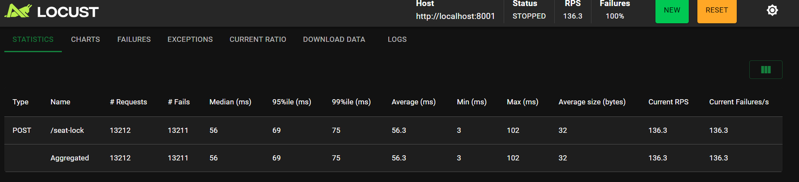
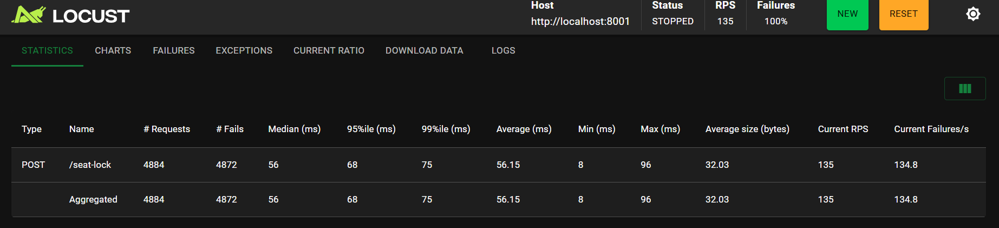
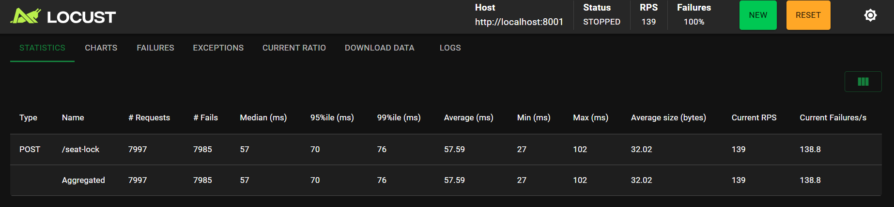
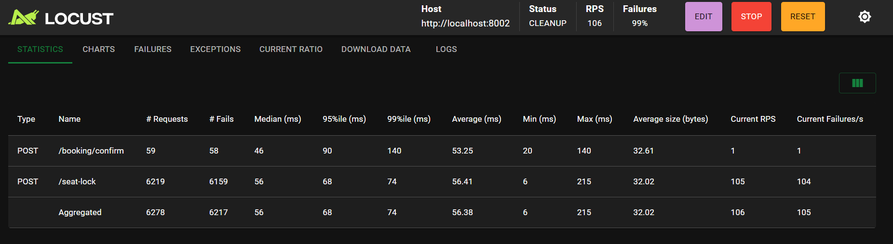

# Seat Allocation Engine

**Stack:** Redis (advisory locks (leases)), PostgreSQL (truth), FastAPI (API)  
**Focus:** Concurrency correctness, idempotency, atomic multi-seat booking, load-tested under race conditions.

This project is intentionally backend-heavy. There is no UI, no auth, and no payments.  
The goal is to solve **seat allocation under concurrency** correctly and prove it with load tests.

---

## Architecture Overview

The system is split into **coordination** and **truth** layers:

- **Redis** is used only for *advisory locking* with TTL.
- **PostgreSQL** is the *single source of truth*.
- **FastAPI** exposes HTTP endpoints.
- **Docker Compose** runs everything locally in isolated containers.

Redis helps reduce contention.  
Postgres is the source of truth.

---


### Two phase booking

The Redis phase absorbs high-concurrency bursts and filters contention early, preventing 
concurrent race condition-causing requests from overwhelming the database. The 
PostgreSQL phase is the final authority, enforcing durability and correctness using 
transactional guarantees and row-level locks. 

---

## Data Model & Constraints

### seats

| column   | type    |
|---------|---------|
| id      | varchar |
| show_id | varchar |
| status  | enum (`AVAILABLE`, `BOOKED`) |

### bookings

| column      | type    |
|------------|---------|
| id         | uuid    |
| show_id    | varchar |
| seat_id    | varchar |
| user_id    | uuid    |
| request_id | uuid    |

### Constraints 

```sql
ALTER TABLE bookings
ADD CONSTRAINT uq_booking_request_seat
UNIQUE (request_id, seat_id);
```

This allows:

- One request_id → multiple seats
- Safe retries
- No duplicate seat booking


---


## Booking Flow


### 1. Seat Lock (Redis)

```
POST /seat-lock
{
  show_id,
  seat_ids,
  user_id
}
```

- Redis keys: lock:{show_id}:{seat_id}
- TTL-based
- Failure returns 409

### 2. Confirm Booking (Postgres)

```
POST /booking/confirm
{
  show_id,
  seat_ids,
  user_id,
  request_id
}
```

#### Inside one DB transaction:

- Verify Redis locks

- SELECT seats FOR UPDATE

- Idempotency check

- Invariant check (all seats AVAILABLE)

- Mark seats BOOKED

- Insert bookings

- Commit

#### Guarantees:

- Atomic multi-seat booking

- No partial commits

- No double booking

---


## Load Testing Summary (performed with Locust)


| # | Test Name                    | What It Validates          | Seats | Users    | Ramp-up | Runtime | TTL   | Screenshot              |
|---|------------------------------|----------------------------|-------|----------|---------|---------|-------|-------------------------|
| 1 | Lock Contention              | Mutual exclusion           | A1    | 50       | 1/sec   | 2m      | 120s  |  |
| 2 | Lock TTL Expiry              | Lock auto-release          | A1    | 50       | 1/sec   | 1m      | 5s    |  |
| 3 | High Ramp-up Lock Race       | Atomic locking             | A1    | 50       | 10/sec  | 1m      | 5s    |  |
| 4 | Confirm Race (Single Seat)   | DB truth beats Redis       | A1    | 20       | 5/sec   | 1m      | 1s    |  |
| 5 | Confirm Race (Multi-seat)    | Atomic commit              | A2,A3 | 20       | 5/sec   | 1m      | 1s    |  |


